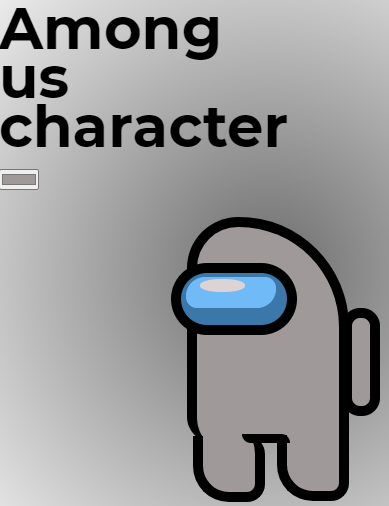

# Among Us color character

- [x] Instead of onchange, use oninput to change the color
- [x] Make a chracter using pure CSS
- [x] Change the character color as being the input value
- [x] Use localStorage to store the input color value. If the page is refreshed, the value remains so
- [x] Organize the code
      
